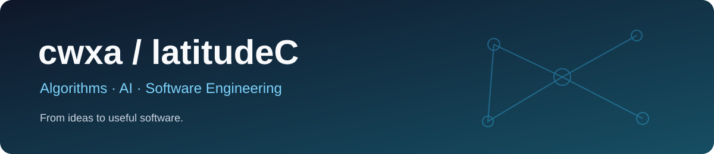

  <a href="https://github.com/cwxa?tab=repositories">浏览项目</a> ·
  <a href="https://github.com/cwxa/HealthyDesk/releases">肩颈助手下载</a> ·
  <a href="https://github.com/cwxa/HealthyDesk/issues">交流与反馈</a>

## 你好，我是 cwxa 👋

关注算法与机器学习、软件工程，以及数据库性能优化。喜欢把复杂问题拆解成清晰的实现，让算法走向实际应用。

**Algorithms → Engineering → Useful software**

## 精选项目

| 项目 | 内容 | 入口 |
| :--- | :--- | :--- |
| **[NeckGuardian · 肩颈健康助手](https://github.com/cwxa/HealthyDesk)** | 本地摄像头姿势监测、活动提醒与健康数据记录，摄像头画面在本机处理。 | [下载](https://github.com/cwxa/HealthyDesk/releases) · [使用说明](https://github.com/cwxa/HealthyDesk#readme) |
| **[研究生知识预备与实践](https://github.com/cwxa/postgraduate_preparation)** | 知识预备与实践 demo，用代码连接学习与应用。 | [浏览仓库](https://github.com/cwxa/postgraduate_preparation) |

## 技术关注

- **算法与机器学习**：算法设计、模型应用，以及实验到工程实现的衔接。
- **软件工程**：清晰的模块设计、可维护代码、日志与性能分析。
- **数据库优化**：SQL、索引设计、批量查询与数据处理。

## 算法实践与学习

- [RMOEA_D](https://github.com/cwxa/RMOEA_D) · Python 算法实践仓库。
- [SchedulingProblem](https://github.com/cwxa/SchedulingProblem) · Python 调度问题实践仓库。
- [Java](https://github.com/cwxa/java) · Java 代码与学习实践。

📚 关注的开源项目与复现资源

以下为 Fork 的学习与研究资源；原项目作者和贡献者的工作请参见对应仓库。

- [E2E-MAPPO-for-MT-FJSP](https://github.com/cwxa/E2E-MAPPO-for-MT-FJSP)：深度强化学习与多目标柔性作业车间调度。
- [skyengine](https://github.com/cwxa/skyengine)：制造仿真与调度平台。
- [eino-examples](https://github.com/cwxa/eino-examples)：Eino 框架示例与实践。

---

把复杂问题讲清楚，把有用的软件做出来。

