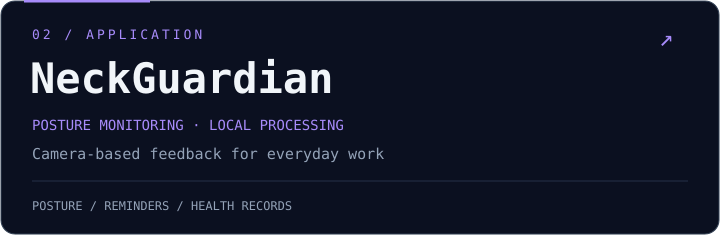

  <a href="https://github.com/cwxa/RMOEA_D">算法研究与复现</a> ·
  <a href="https://github.com/cwxa/HealthyDesk">应用开发</a> ·
  <a href="https://github.com/cwxa?tab=repositories">全部项目</a>

<code>REINFORCEMENT LEARNING</code> · <code>MULTI-OBJECTIVE OPTIMIZATION</code> · <code>SOFTWARE ENGINEERING</code>

  

## `01` / 关于我

关注**智能优化、机器学习与软件开发**，探索算法如何解决实际问题。
从调度算法的复现与实验分析，到面向日常使用的应用开发，我重视实现的可维护性、实验的可复现性，以及结果的清晰表达。

## `02` / 精选项目

面向**双目标模糊柔性作业车间调度**的 Python 求解器，复现论文 *A reinforcement learning based RMOEA/D for bi-objective fuzzy flexible job shop scheduling* 的核心算法，同时优化模糊最大完工时间与总机器工作负载。

- **算法实现**：以 MOEA/D 为框架，结合 Q-PAS（Q-learning 自适应邻域选择）与 RVNS（强化学习驱动的变邻域搜索）。
- **实验分析**：包含 Brandimarte Mk01–Mk10 实例、MOEA/D 基线对照、组件消融实验与统计分析。
- **结果呈现**：支持 Pareto 前沿、超体积（HV）对比与调度甘特图，并提供论文实现一致性核对与复现差异说明。

[项目说明](https://github.com/cwxa/RMOEA_D/blob/main/readme.md) · [论文与复现对照](https://github.com/cwxa/RMOEA_D/blob/main/docs/paper-vs-reproduction.md) · [实现一致性核对](https://github.com/cwxa/RMOEA_D/blob/main/docs/paper-implementation-conformance.md)

将姿势监测与活动提醒融入日常工作：通过摄像头检测坐姿、记录健康数据，并提醒适时活动。**摄像头画面在本机处理**，兼顾实用体验与隐私。

[使用说明](https://github.com/cwxa/HealthyDesk#readme) · [下载安装](https://github.com/cwxa/HealthyDesk/releases) · [问题反馈](https://github.com/cwxa/HealthyDesk/issues)

## `03` / 技术关注

| 方向 | 关注内容 |
| :--- | :--- |
| **智能优化与机器学习** | 多目标优化、强化学习、调度问题、算法复现与实验分析 |
| **软件工程** | 模块设计、可维护代码、日志追踪与性能分析 |
| **数据库与数据处理** | SQL 优化、索引设计、批量查询与数据处理 |

## `04` / 学习与实践

- [研究生知识预备与实践](https://github.com/cwxa/postgraduate_preparation)：整理知识预备内容，并通过 demo 加深理解。
- [SchedulingProblem](https://github.com/cwxa/SchedulingProblem)：Python 调度问题实践。
- [Java](https://github.com/cwxa/java)：Java 代码与学习实践。

📚 开源学习与复现资源

以下仓库为 Fork 的学习与研究资源，原始成果归属请参见原项目作者及贡献者说明。

- [E2E-MAPPO-for-MT-FJSP](https://github.com/cwxa/E2E-MAPPO-for-MT-FJSP)：深度强化学习与多目标柔性作业车间调度。
- [skyengine](https://github.com/cwxa/skyengine)：制造仿真与调度平台。
- [eino-examples](https://github.com/cwxa/eino-examples)：Eino 框架示例。

## `05` / 贡献轨迹 🐍

让每一次提交，都成为前进的一格。

<picture>
  <source media="(prefers-color-scheme: dark)" srcset="https://raw.githubusercontent.com/cwxa/cwxa/output/github-snake-dark.svg" />
  <source media="(prefers-color-scheme: light)" srcset="https://raw.githubusercontent.com/cwxa/cwxa/output/github-snake.svg" />
  
</picture>

每日自动更新 · 根据 GitHub 主题切换配色

---

用实验理解算法，用工程实现价值。

